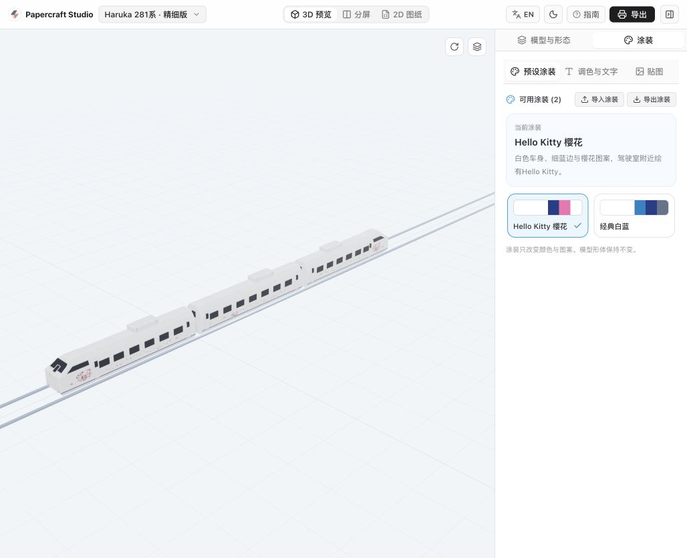
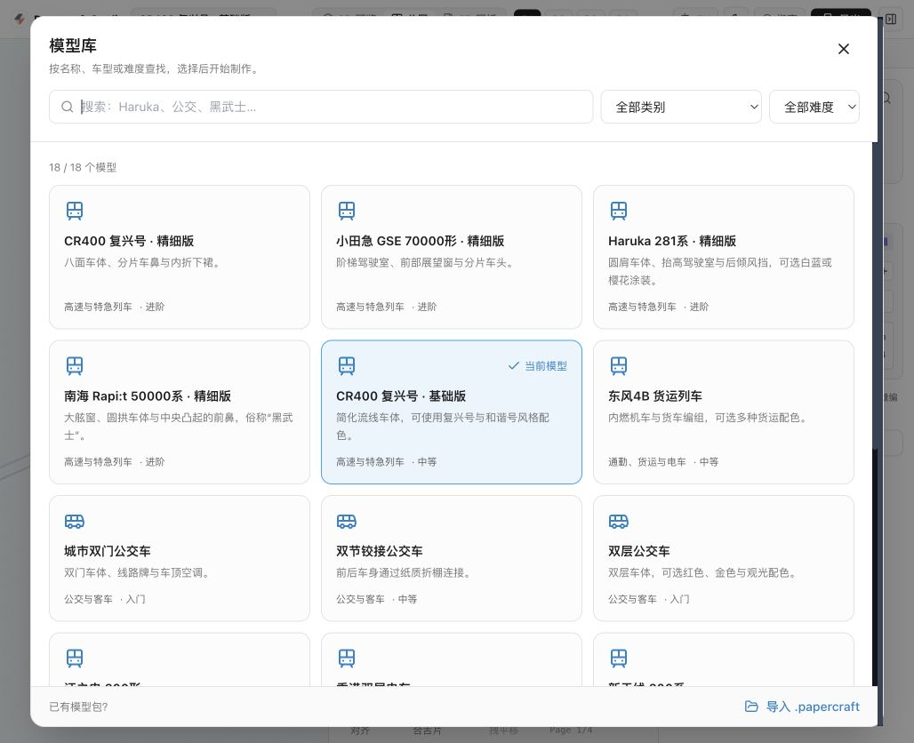

# Papercraft Studio

[中文](#中文) · [English](#english)

<a id="中文"></a>

## 中文

Papercraft Studio 是一个浏览器中的车辆纸模工具，用于选择模型、调整编组与涂装，并导出带剪折线和粘合翼的 A4 图纸。



### 主要能力

- **模型与编组**：提供列车、公交车和有轨电车，支持名称搜索、类别与难度筛选。CR400、GSE、Haruka 281 和 Rapi:t 50000 各有基础版与精细版；支持编组的车型可增减中间车厢。
- **涂装定制**：选择兼容预设，调整颜色和文字，或上传侧身插画、贴图总谱。标为“风格”的配色只改变图案，不将车体变为另一车型。
- **预览与展开**：在 3D、2D 或分屏视图中检查模型。复杂车体分为多个纸片，使用接缝编号配对，并提供纸质车钩等连接件。
- **导出与交换**：导出带矢量剪折线的 A4 PDF；用 `.papercraft` 交换模型与涂装资源，用 `.papercraft-livery` 单独交换涂装。



### 使用方式

1. 打开模型库，选择车型与制作难度。
2. 调整编组，在“预设涂装”“调色与文字”或“贴图”中设置外观。
3. 检查 3D 外形和各页展开图，按同一车厢内的接缝编号确认连接关系。
4. 导出 PDF，以 **100% / 实际大小** 打印，核对图纸上的 **50 mm** 标尺，再剪裁、压折和粘合。

### 当前限制

- 复杂曲面使用平面折面近似，并非精确工程缩尺。纸厚、粘贴顺序和接缝强度仍需实物试装；展开不保证最少切口或最少页数，目前仅自动分页到 A4。
- 切换模型会保留各自的编辑状态，**刷新页面会清除这些状态**。`.papercraft` 是模型与涂装资源包，不是包含当前编组、全部调色、文字及上传贴图的项目存档。
- 上传图片按既定贴图布局映射到模型；目前没有自由编辑模型几何或 UV 的可视化工具。

### 本地开发

需要 Node.js 与 npm。

```bash
npm install
npm run dev      # 启动开发服务，访问终端显示的地址
npm test         # 几何、接缝、贴图与模型库回归检查
npm run build    # 构建到 dist/
npm run preview  # 本地预览构建产物
```

使用 React、TypeScript、Vite、Three.js 和 Tailwind CSS；PDF 与资源包由 jsPDF、JSZip 生成。

### 文档

- [模型库、涂装与新增模型约定](docs/model-library.md)
- [Haruka / Rapi:t 精细版制作说明](docs/professional-trains.md)
- [几何、展开、贴图与验证约束](docs/geometry-pipeline.md)

---

<a id="english"></a>

## English

Papercraft Studio is a browser tool for choosing vehicle models, adjusting consists and liveries, and exporting A4 paper patterns with cut lines, folds and glue tabs.


### Features

- **Models and consists**: Trains, buses and trams with name search, category and difficulty filters. CR400, GSE, Haruka 281 and Rapi:t 50000 have basic and detailed variants. Models that support consists allow middle cars to be added or removed.
- **Livery customization**: Choose compatible presets, adjust colors and text, or upload side artwork and texture atlases. Liveries described as another vehicle's “style” change artwork, not the body geometry.
- **Preview and nets**: Inspect models in 3D, 2D or split view. Complex bodies unfold into multiple pieces with matching seam numbers and include paper couplers or other connecting parts.
- **Export and exchange**: Export A4 PDFs with vector construction lines. Exchange model and livery resources through `.papercraft` packages, or individual liveries through `.papercraft-livery` files.


### Usage

1. Open the model library and choose a vehicle and crafting difficulty.
2. Adjust the consist and use Presets, Colors & Text or Artwork to customize its appearance.
3. Inspect the 3D body and every sheet, matching seam numbers within each car.
4. Export the PDF and print at **100% / Actual size**. Check the **50 mm** ruler before cutting, scoring and gluing.

### Limitations

- Curved surfaces use planar facets; models are not exact engineering-scale replicas. Paper thickness, assembly order and joint strength still require physical trials. Nets do not guarantee the fewest cuts or sheets, and automatic pagination currently supports A4 only.
- Each model retains its editing state while switching, but **reloading the page clears these drafts**. A `.papercraft` package contains model and livery resources, not a complete project snapshot of the current consist, color edits, text and uploaded artwork.
- Uploaded images follow predefined texture layouts. There is currently no visual editor for arbitrary model geometry or UV coordinates.

### Local development

Requires Node.js and npm.

```bash
npm install
npm run dev      # Open the address printed in the terminal
npm test         # Geometry, seams, artwork and catalog regression checks
npm run build    # Build into dist/
npm run preview  # Preview the production build locally
```

Built with React, TypeScript, Vite, Three.js and Tailwind CSS. jsPDF and JSZip generate PDFs and resource packages.

### Documentation

- [Model library, liveries and adding models](docs/model-library.md)
- [Detailed Haruka / Rapi:t assembly notes](docs/professional-trains.md)
- [Geometry, nets, textures and validation contracts](docs/geometry-pipeline.md)

---

MIT License.
